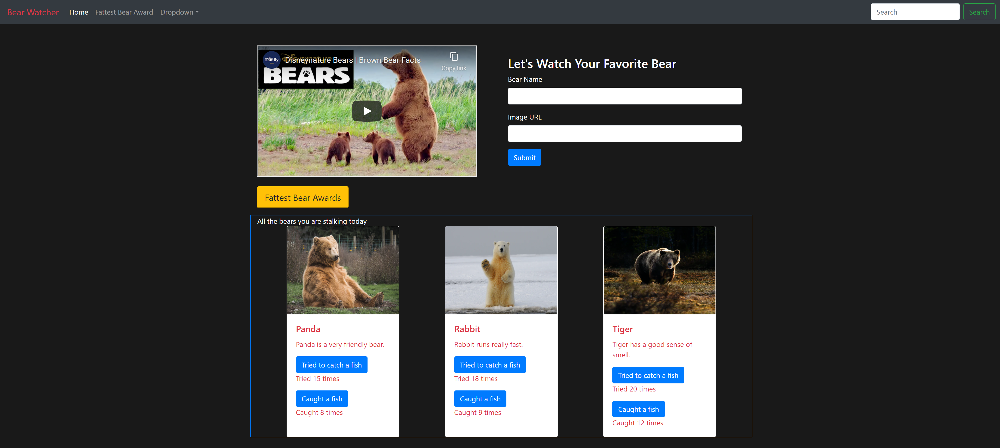

# Bear Watcher

## Description
Bear Watcher is an application where you can track the bear of your liking to see how many attempts a bear made to catch a fish and how many times a bear caught a fish. This was an assignment to practice JavaScript modules.

## Screenshot

## How to run
1. Clone down this repo
2. Make sure you have http-server installed via npm.
3. npm start

## Wireframe
https://www.figma.com/file/DY7XjIE2x70kkSlcc2Kr2t/Bear-Watcher-CS?node-id=0%3A1

## Link to the bear watcher page
https://cs-bear-watcher.netlify.app/

